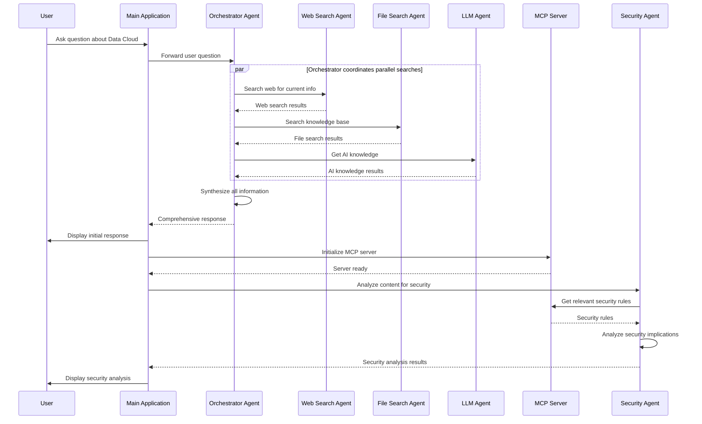
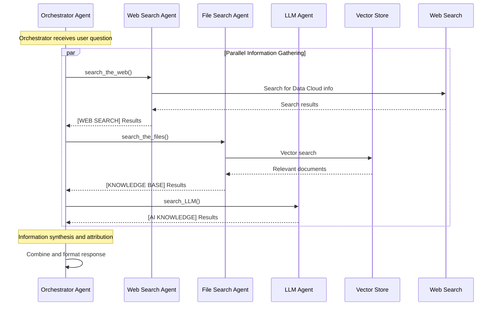
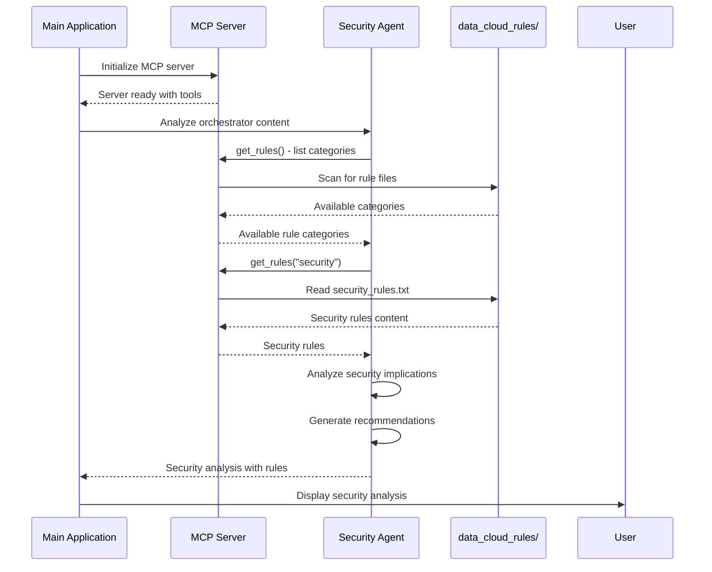
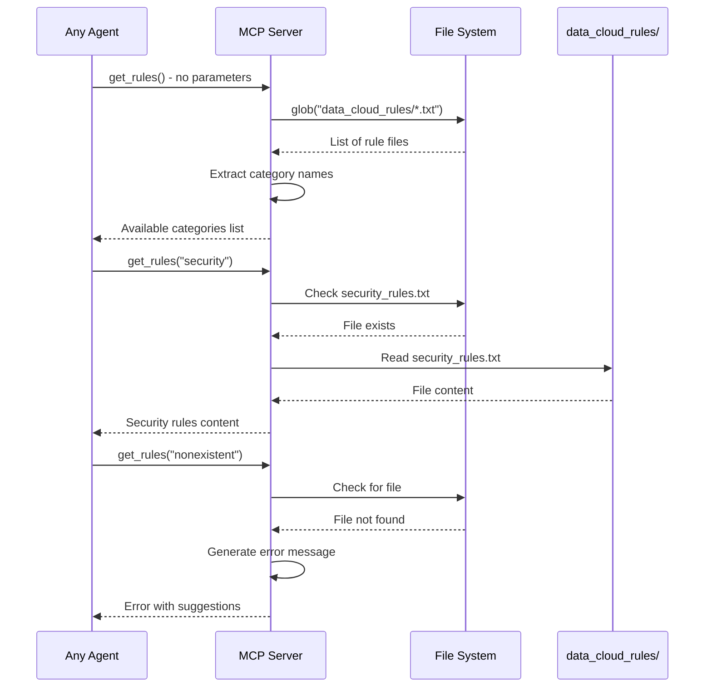

# AIAgentsQuery

A sophisticated multi-agent system that provides comprehensive answers about Salesforce Data Cloud by orchestrating multiple specialized AI agents and integrating with a Model Context Protocol (MCP) server for rule-based knowledge retrieval.

## Overview

AIAgentsQuery is an intelligent query system that combines web search, knowledge base search, AI knowledge, and security analysis to provide comprehensive answers about Salesforce Data Cloud. The system uses a multi-agent architecture where specialized agents work together to gather, synthesize, and analyze information from multiple sources.

## Architecture

The system consists of several key components:

### 1. Multi-Agent Orchestration System
- **Orchestrator Agent**: Coordinates all other agents and synthesizes information
- **Web Search Agent**: Searches the web for current Salesforce Data Cloud information
- **File Search Agent**: Searches through vectorized knowledge base
- **LLM Agent**: Provides built-in AI knowledge about Data Cloud
- **Security Agent**: Analyzes security implications and compliance requirements

### 2. MCP Server Integration
- **MCP Server**: Provides access to rule-based knowledge from `data_cloud_rules/` folder
- **Rule Categories**: Security, Data Modeling, Ingestion, Connected Apps, Segmentation

### 3. Knowledge Base
- Vectorized documentation and resources
- Rule-based knowledge files organized by category

## System Interactions

### Main Application Flow



### Agent Interaction Details



### MCP Server and Security Analysis



### MCP Server Tool Interaction



## Components

### 1. Orchestrator Agent
The master coordinator that:
- Manages all other agents
- Synthesizes information from multiple sources
- Provides source attribution ([WEB SEARCH], [KNOWLEDGE BASE], [AI KNOWLEDGE])
- Ensures comprehensive and accurate responses

### 2. Web Search Agent
Specialized agent for web research that:
- Searches for current Salesforce Data Cloud information
- Focuses on official documentation and reputable sources
- Prioritizes recent information (within 2 years)
- Provides source attribution

### 3. File Search Agent
Knowledge base specialist that:
- Searches through vectorized documentation
- Finds technical details and best practices
- Cites specific files and sections
- Synthesizes information from multiple documents

### 4. LLM Agent
AI knowledge provider that:
- Provides comprehensive Data Cloud information
- Explains technical concepts clearly
- Offers practical examples and use cases
- Shares best practices and recommendations

### 5. Security Agent
Security and compliance expert that:
- Analyzes content for security implications
- Identifies relevant security topics
- Provides compliance recommendations
- Integrates with MCP server for rule-based guidance

### 6. MCP Server
Model Context Protocol server that:
- Provides access to rule-based knowledge
- Manages rule categories (security, data modeling, etc.)
- Offers tool-based interface for rule retrieval
- Handles file system operations for rule access

## Rule Categories

The system includes predefined rule categories in the `data_cloud_rules/` folder:

- **Security Rules**: Data protection, access controls, compliance
- **Data Modeling Rules**: Schema design, data relationships
- **Ingestion Rules**: Data loading, transformation, validation
- **Connected App Rules**: Integration patterns, authentication
- **Segmentation Rules**: Data partitioning, performance optimization

## Setup and Installation

1. **Install Dependencies**:
   ```bash
   pip install -r requirements.txt
   ```

2. **Environment Configuration**:
   Create a `.env` file with:
   ```
   OPENAI_API_KEY=your_openai_api_key
   VECTOR_STORE_ID=your_vector_store_id
   ```

3. **Run the Application**:
   ```bash
   python agent_chain.py
   ```

## Testing the MCP Server

You can test your MCP server independently using the MCP CLI development tools:

```bash
mcp dev mcp_server.py
```

This command will start the MCP server in development mode, allowing you to:
- Test the `get_rules` tool directly
- Verify rule file access and parsing
- Debug any issues with the MCP server implementation
- See detailed logs of tool invocations

### Installing uv (if needed)

The `mcp` command-line tool may require `uv` for optimal performance. To install `uv`:

**On macOS and Linux:**
```bash
curl -LsSf https://astral.sh/uv/install.sh | sh
```

**On Windows (PowerShell):**
```powershell
powershell -c "irm https://astral.sh/uv/install.ps1 | iex"
```

**Using pip:**
```bash
pip install uv
```

After installation, you may need to restart your terminal or add `uv` to your PATH. The `uv` tool provides faster Python package management and is recommended for MCP development workflows.

## Usage

1. Start the application
2. Enter your question about Salesforce Data Cloud
3. The system will:
   - Search multiple sources in parallel
   - Synthesize comprehensive information
   - Provide source attribution
   - Analyze security implications
   - Display both general and security-focused responses

## Key Features

- **Multi-Source Information Gathering**: Combines web search, knowledge base, and AI knowledge
- **Source Attribution**: Clearly marks information sources
- **Security Analysis**: Automatic security implications analysis
- **Rule-Based Knowledge**: Integration with MCP server for structured rules
- **Parallel Processing**: Efficient concurrent information gathering
- **Comprehensive Coverage**: Addresses technical, security, and compliance aspects

## Technical Stack

- **Python**: Core application language
- **OpenAI Agents**: Multi-agent orchestration framework
- **MCP (Model Context Protocol)**: Tool integration and rule management
- **Vector Store**: Knowledge base search capabilities
- **Web Search**: Real-time information retrieval
- **Environment Management**: dotenv for configuration

## Architecture Benefits

- **Modularity**: Each agent has a specific, well-defined role
- **Scalability**: Easy to add new agents or modify existing ones
- **Reliability**: Multiple information sources ensure comprehensive coverage
- **Security**: Dedicated security analysis with rule-based guidance
- **Maintainability**: Clear separation of concerns and well-structured code
